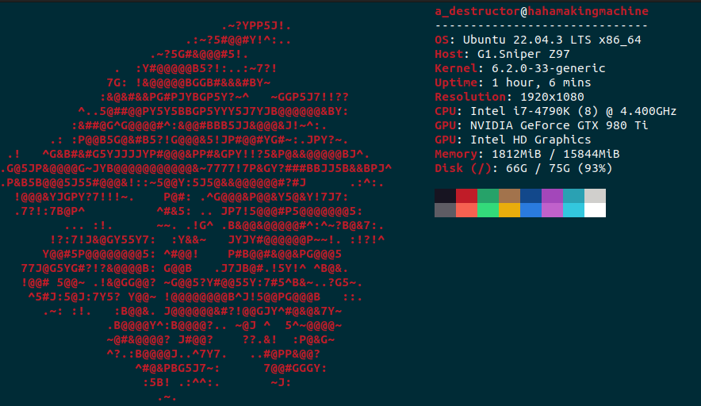
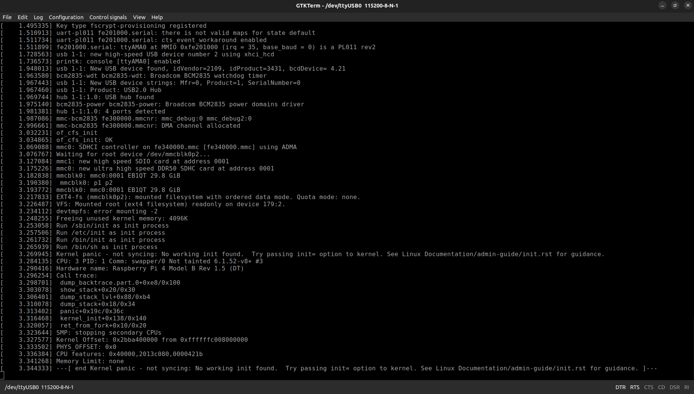

# Linux_Kernel_Built_For_RPi4

This is a Linux kernel configured and built for Raspberry Pi 4. This README file will walk you through the process as I experienced it.

Notes:
  1. This kernel was built on 12/9/2023. Some steps may differ/be omitted altogether. Please, bare in mind that U-Boot is a piece of software that gets updated constantly and your steps may vary depending on when you decide to build/use it.
  2. This kernel was built on an Ubuntu 22.04 system on my trusty ten-year-old PC with the following specs:
       1. i7 4790k @4.4GHz
       1. 16GB DDR3 RAM @2400MHz
       1. GTX 980ti (irrelevant to this project) 
       1. A Kingston HyperX Savage SSD.
       
       
        
  3. The kernel was built for Raspberry Pi 4 using a custom cross-toolchain I created in an earlier project. Feel free to visit it for more detail: [Crosstool-NG_RPi4](https://github.com/AhmedAlyEl-Ghannam/Crosstool-NG_RPi4). Additionally, the U-Boot-based bootloader I created in an earlier project is also needed: [Our-Boot_U-Boot_bootloader_for_RPi4](https://github.com/AhmedAlyEl-Ghannam/Our-Boot_U-Boot_bootloader_for_RPi4)
  4. The source I followed is Chris Simmond's book "Mastering Embedded Linux Programming - Second Edition" chapter 4: Configuring and Building the Kernel. It is a fantastic book that I STRONGLY recommend. But, bear in mind that the instructions listed in the chapter are for Beaglebone Black. If you use any other single board computer, you are on your own. If you decide to use Raspberry Pi 4, you came to the right place comrade.


## Building the Kernel and its shenanigans

1. Clone the Linux repository. At first, I used the official Linux-Stable repository but later found out that it does not have a config file for the Raspberry Pi 4's SoC. So, I cloned the official Raspberry Pi Linux repo (I have also read that it is more stable to use). Make sure to clone it where you want to use it.

   ```
   git clone git@github.com:raspberrypi/linux.git
   ```


2. Open the cloned repository folder and make sure you are operating on the latest branch. `rpi-6.5.y` is the latest branch as of the time of writing this README file.

   ```
   cd linux
   git checkout remotes/origin/rpi-6.5.y
   ```


3. Kernel has to be cross compiled. I will be using the toolchain I created in an earlier project. **The kernel version must be higher than the kernel version configured for the toolchain. Make sure it meets that requirement.** Since we are building a linux kernel v6.5.y, the toolchain must be configured for a version lower than that---I configured mine to 6.0.y.
   
  ```
  PATH=${HOME}/x-tools/aarch64-rpi4-linux-gnu/bin/:$PATH
  ```


4. Select the configuration file for Raspberry Pi 4's SoC: bcm2711. Make sure to write `arm64` as your architecture and `aarch64-rpi4-linux-gnu-` as your toolchain prefix.

   ```
   make bcm2711_defconfig ARCH=arm64 CROSS_COMPILE=aarch64-rpi4-linux-gnu-
   ```


5. You can open the TUI configuration menu for more options. Personally, I left it as it is.

   ```
   make menuconfig ARCH=arm64 CROSS_COMPILE=aarch64-rpi4-linux-gnu-
   ```

6. Now, to start building the kernel, device tree binaries, and kernel modules; enter this command. The option `-j8` speeds up the process significantly as it will use the a number of parallel processes equal to the number specified in the command: 8 here is for number of logical cores I have. I added `time` to calculate the time my PC will take to finish the command. **Note that I wrote `Image` instead of 'zImage': 64-bit images cannot be stored in zImage format.**

   ```
   time make -j8 Image modules dtbs ARCH=arm64 CROSS_COMPILE=aarch64-rpi4-linux-gnu-
   ```
   
   


## Installing the Kernel and its shenanigans

1. Install kernel modules in the desired directory.

   ```
   sudo make install INSTALL_MOD_PATH=output/modules ARCH=arm64 CROSS_COMPILE=aarch64-rpi4-linux-gnu-
   ```


2. Move the generated `Image` and `bcm2711-rpi-4-b.dtb` generated to your boot partition.

   ```
   cp arch/arm64/boot/Image /media/a_destructor/boot/kernel8.img
   cp arch/arm64/boot/dts/broadcom/bcm2711-rpi-4-b.dtb /media/a_destructor/boot
   ```


3. Move all `.dtbo` files to overlay folder in your boot partition.

  ```
  cp arch/arm64/boot/dts/overlays/* /media/a_destructor/boot/overlays
  ```


## Booting the Kernel

*The following steps require the addition of a number of Raspberry Pi's closed-source firmware: make sure to download it from their [official repository](https://github.com/raspberrypi/firmware/tree/stable/boot).*

1. Copy `start4.elf`, `bootcode.bin`, and `fix4up.dat` to your boot partition.


2. Creating config.txt and cmd.txt is crucial: cmd.txt contains startup commands while config.txt contains essential pre-boot configurations. Feel free to download mine.


3. Now, for the final step: connect USB to TTL to both your PC and RPi4, then open your serial terminal of choice.

   ```
   gtkterm -p /dev/ttyUSB0 -s 115200
   ```


4. Power on the Pi, and you should see a screen like this:

   


Seeing the kernel panic is fine since the root filesystem has not been mounted yet and, more importantly, the `init` process cannot be found. Feel free to checkout my next project where I build a root filesystem and setup basic system utilities using Busybox: [Root_and_Utils_Using_Busybox](https://github.com/AhmedAlyEl-Ghannam/Root_and_Utils_Using_Busybox).


